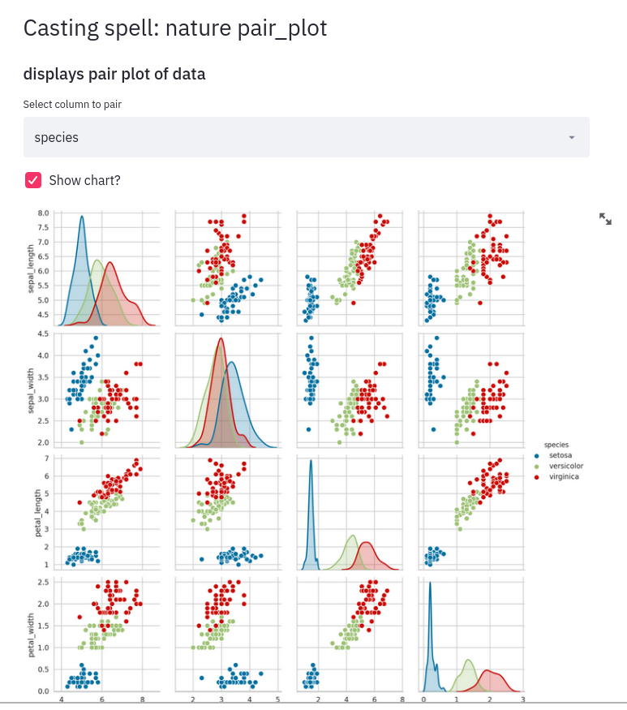
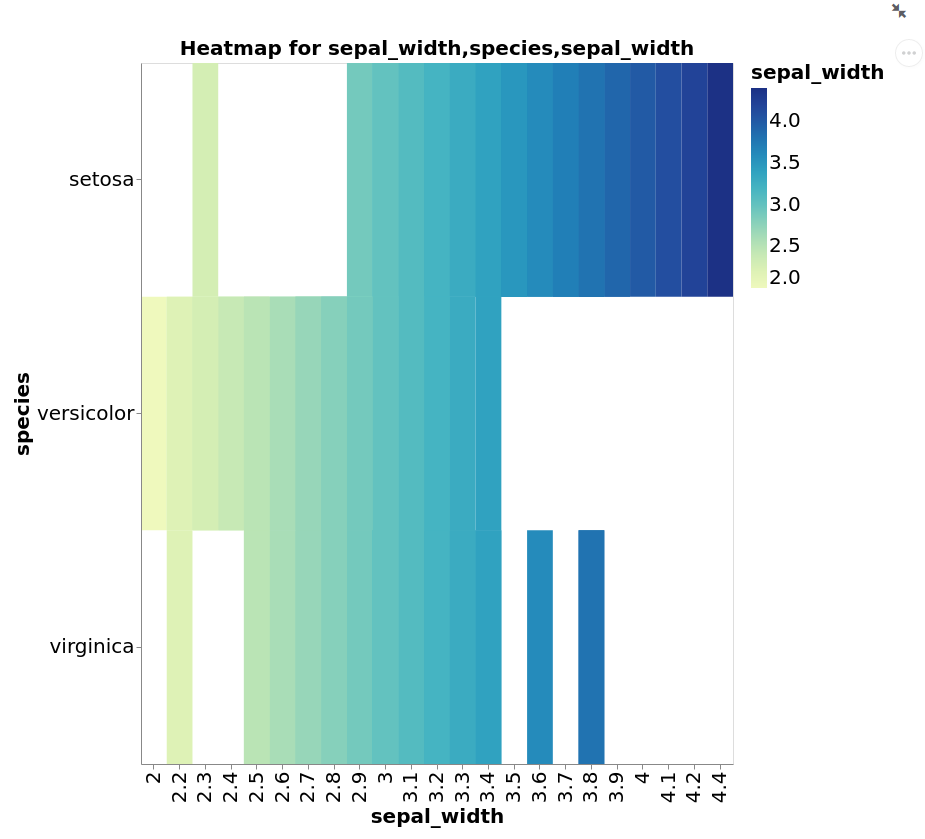
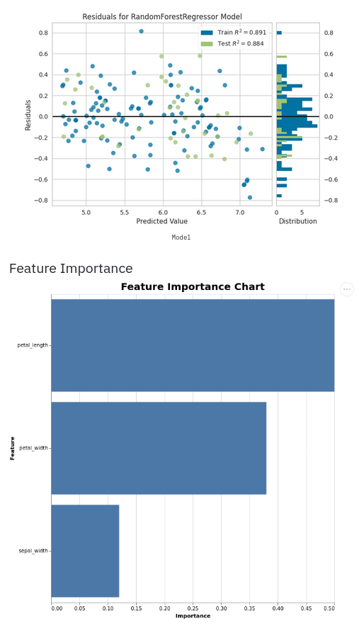
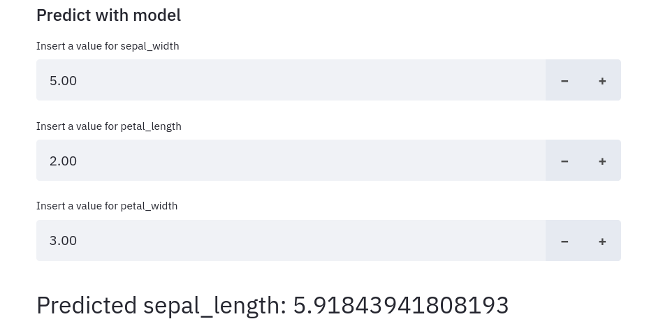
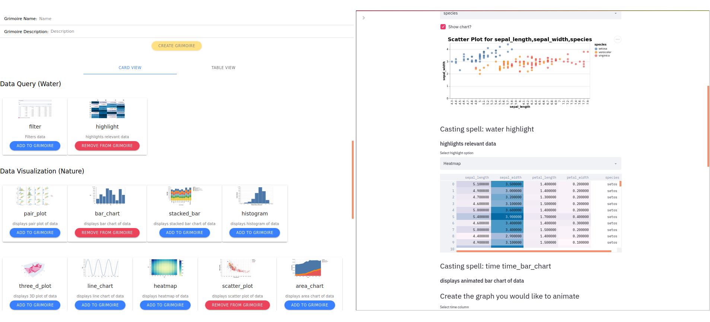

**Grimoire is an open source platform to create interactive data stories, without needing to code.
Grimoire is powered by [Streamlit](https://www.streamlit.io/) which provides a full stack framework for developing data driven applications.**

## Interactive Demo
Insert Link to [demo](#)


## Running
Requires [docker](https://www.docker.com/)

```bash
git clone https://github.com/aether-ai/grimoire
cd grimoire
bash grim_run.sh
```

## Features 

**Grimoire is like a web site builder for data analysis.**

You can mix and match individual components to create your own workflow or use predefined templates.     
Each component is referred to as a spell, while a collection of spells is a Grimoire.    
Spells are made up of python code integrated with Streamlit to provide user interaction.  

## Example workflows
Here are some example workflows

### Visualize your Data



### Train your own Model




### Create your own Workflow

